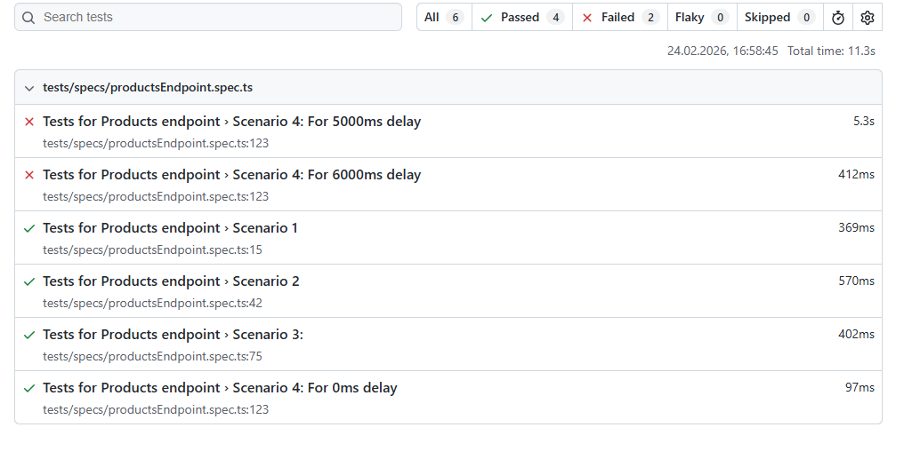

---
### 1. Installation 

Run command line. All dependencies will be installed with all playwright browsers.
```bash
npm run start
```

### 2. Run tests in headless mode

```bash
npm run test
```

### 3. Run tests with the browser window 

```bash
npm run test-headed
```

### 4. Show report

After the tests finish, generate and open the report by running:
```bash
npm run report
```

### Proof of the execution: 




## Project Structure

The API test automation framework is organized as follows:

### Directory Overview

```
api/
├── tests/                          
│   ├── Fixtures.ts                 # Playwright fixtures for test setup and configuration
│   ├── specs/                      # Test specifications (test cases)
│   └── src/                        # Source code for API testing infrastructure
│       ├── ApiBuilder.ts           # Base API builder for constructing HTTP requests
│       ├── ProductsApiBuilder.ts   # Specialized builder for product endpoint requests
│       ├── builders/               # Additional builder classes
│       │   └── ProductBuilder.ts   # Builder for product request payloads
│       ├── data/                   # Test data and configuration
│       │   └── Endpoints.ts        # API endpoint URLs and routes
│       └── models/                 # TypeScript models and interfaces
│           ├── Product.ts          # Product data model
│           ├── ProductList.ts      # Product list response model
│           └── PerformanceTimer.ts # Performance measurement model
├── playwright.config.ts            # Playwright configuration (browser settings, timeouts, etc.)
├── package.json                    # NPM dependencies and scripts
└── README.md                        # This file
```
