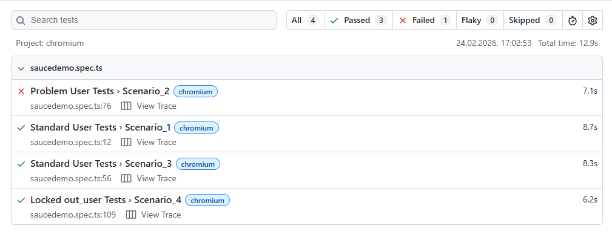

---
### 1. Installation 

Run command line. All dependencies will be installed with all playwright browsers.
```bash
npm run start
```

### 2. Run tests in headless mode

```bash
npm run test
```

### 3. Run tests with the browser window 

```bash
npm run test-headed
```

### 4. Show report

After the tests finish, generate and open the report by running:
```bash
npm run report
```

### Proof of the execution: 


